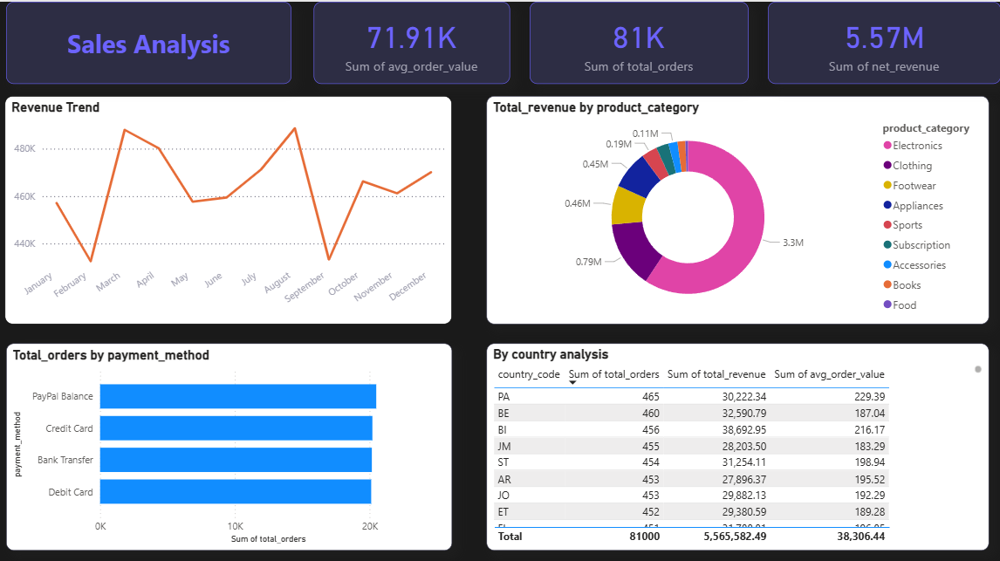
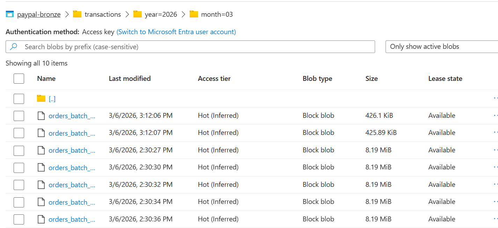
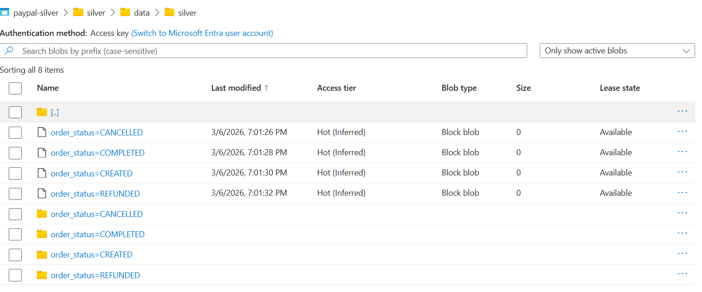
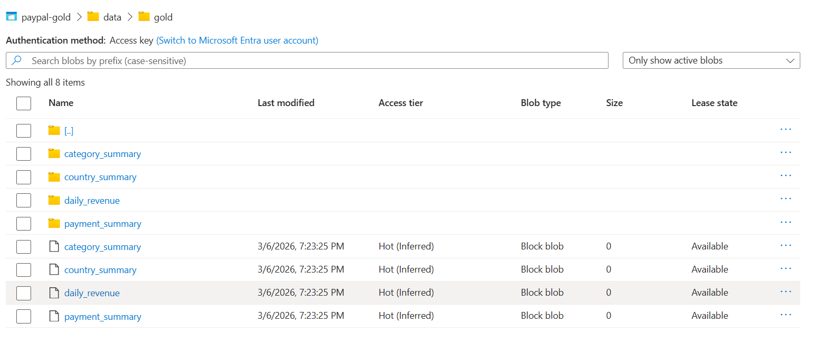
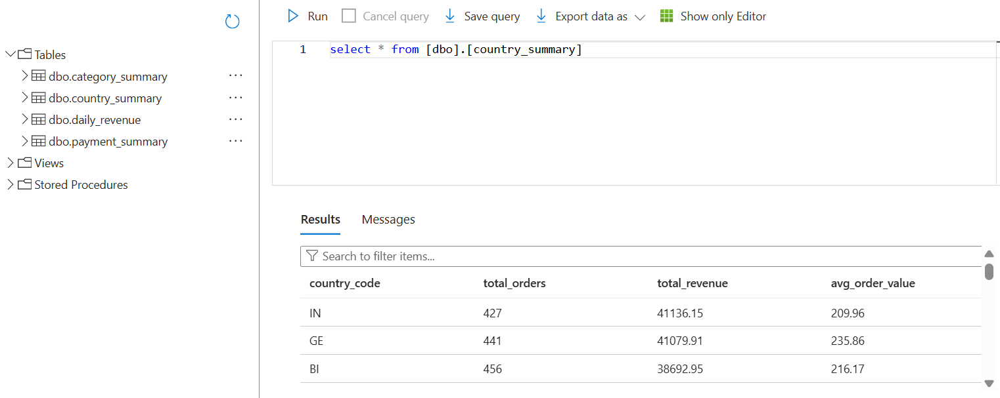
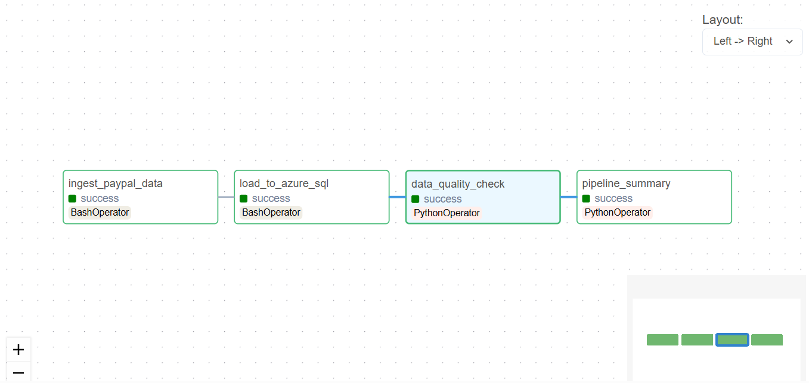

# 💳 PayPal E-Commerce Data Pipeline


> End-to-end batch data pipeline on Azure processing 100,000+ e-commerce transactions using PySpark, Airflow, and Docker — with a Power BI analytics dashboard.

---

## 📌 Project Overview

This project simulates a real-world data engineering pipeline for a PayPal-based e-commerce platform. It ingests transaction data from the PayPal Sandbox API, processes it through a **Bronze → Silver → Gold** medallion architecture on Azure Data Lake, loads it into Azure SQL, and visualizes it in Power BI.

---

## 🏗️ Architecture

```
PayPal Sandbox API
        │
        ▼
┌───────────────────┐
│   Ingestion Layer  │  Python + Faker (100k orders)
│  generate_and_    │
│  upload.py        │
└────────┬──────────┘
         │
         ▼
┌───────────────────┐
│  Azure Data Lake  │
│                   │
│  🥉 Bronze Layer  │  Raw JSON files
│  🥈 Silver Layer  │  Cleaned Parquet (PySpark)
│  🥇 Gold Layer    │  Aggregated Parquet (PySpark)
└────────┬──────────┘
         │
         ▼
┌───────────────────┐
│  Azure SQL DB     │  4 analytics tables
└────────┬──────────┘
         │
         ▼
┌───────────────────┐
│  Power BI         │  Interactive dashboard
└───────────────────┘
         ▲
         │
┌───────────────────┐
│  Apache Airflow   │  Orchestration (Docker)
│  (Docker)         │  Daily schedule 6am UTC
└───────────────────┘
```

---

## 🛠️ Tech Stack

| Layer | Technology |
|-------|-----------|
| Ingestion | Python, PayPal Sandbox API, Faker |
| Storage | Azure Data Lake Gen2 |
| Transformation | PySpark 3.5 |
| Orchestration | Apache Airflow 2.x + Docker |
| Database | Azure SQL Database |
| Visualization | Power BI Desktop |
| Language | Python 3.11 |
| Version Control | Git + GitHub |

---

## 📊 Dashboard



**Key Metrics:**
- 💰 Total Revenue: $5.57M
- 📦 Total Orders: 81,000
- 💳 Avg Order Value: $71.91
- 🔄 Top Category: Electronics (59%)

---

## 🗂️ Project Structure

```
paypal-data-pipeline/
├── config/
│   ├── settings.py              # Environment config
│   └── azure_config.py          # Azure ADLS client
├── ingestion/
│   ├── paypal_auth.py           # OAuth2 token
│   ├── paypal_client.py         # PayPal API client
│   ├── generate_and_upload.py   # 100k order generator
│   └── load_to_sql.py           # Gold → Azure SQL
├── transformations/
│   ├── bronze_to_silver.py      # PySpark: raw → clean
│   └── silver_to_gold.py        # PySpark: clean → aggregated
├── dags/
│   └── paypal_pipeline_dag.py   # Airflow DAG
├── tests/
│   └── data_quality.py          # Quality checks
├── docker/
│   └── docker-compose.yml       # Airflow + Postgres
├── docs/
│   └── screenshots/             # Project screenshots
├── sql/
│   ├── create_tables.sql
│   └── gold_queries.sql
├── .env.example
├── requirements.txt
└── README.md
```

---

## 🔄 Pipeline Flow

### 1️⃣ Ingestion
- Connects to PayPal Sandbox API via OAuth2
- Generates 100,000 realistic orders using Faker
- Uploads raw JSON to Azure Data Lake **Bronze** container
- Partitioned by `year/month`

### 2️⃣ Bronze → Silver (PySpark)
- Downloads raw JSON from Bronze layer
- Flattens nested PayPal JSON schema
- Adds derived columns: `is_completed`, `is_refunded`, `revenue`
- Writes clean **Parquet** to Silver layer
- Partitioned by `order_status`

### 3️⃣ Silver → Gold (PySpark)
- Reads Silver Parquet files
- Computes 4 aggregation tables:
  - `daily_revenue` — revenue trends by day
  - `category_summary` — breakdown by product category
  - `payment_summary` — breakdown by payment method
  - `country_summary` — breakdown by country
- Writes to Gold layer as Parquet

### 4️⃣ Load → Azure SQL
- Downloads Gold Parquet files
- Bulk loads into 4 Azure SQL tables
- Ready for BI tool consumption

### 5️⃣ Orchestration (Airflow)
- 4 tasks: ingest → load SQL → quality check → summary
- Runs in Docker (Airflow + Postgres)

### 6️⃣ Data Quality Checks
- Bronze: file existence, null IDs, valid statuses
- Silver: schema validation, no duplicates, no negatives
- Gold: table existence, positive revenue, valid counts

---

## 📸 Screenshots

### Azure Data Lake — Bronze Layer


### Azure Data Lake — Silver Layer


### Azure Data Lake — Gold Layer


### Azure SQL — Tables


### Airflow DAG


### Power BI Dashboard


---

## ⚙️ Setup Guide

### Prerequisites
- Python 3.11+
- Java 17 (for PySpark)
- Docker Desktop
- Azure Account (free tier works)
- Power BI Desktop

### 1. Clone the repo
```bash
git clone https://github.com/saurabh9893/paypal-data-pipeline.git
cd paypal-data-pipeline
```

### 2. Create virtual environment
```bash
python -m venv venv
venv\Scripts\activate      
```

### 3. Install dependencies
```bash
pip install -r requirements.txt
```

### 4. Configure environment
```bash
cp .env.example .env
# Fill in your credentials in .env
```

### 5. Run ingestion
```bash
python -m ingestion.generate_and_upload
```

### 6. Run transformations
```bash
python -m transformations.bronze_to_silver
python -m transformations.silver_to_gold
```

### 7. Load to Azure SQL
```bash
python -m ingestion.load_to_sql
```

### 8. Run data quality checks
```bash
python -m tests.data_quality
```

### 9. Start Airflow
```bash
cd docker
docker-compose up -d
# Open http://localhost:8080
```

---

## 🌍 Azure Resources

| Resource | Name |
|----------|------|
| Storage Account | saudeproject |
| Bronze Container | paypal-bronze |
| Silver Container | paypal-silver |
| Gold Container | paypal-gold |
| SQL Server | paypal-sql-server |
| SQL Database | paypal-db |

---

## 📈 Key Learnings

- Implemented **Medallion Architecture** (Bronze/Silver/Gold) on Azure
- Used **PySpark** for distributed data transformation at scale
- Orchestrated pipeline with **Apache Airflow** in Docker
- Applied **data quality checks** across all pipeline layers
- Built end-to-end pipeline from API ingestion to BI dashboard

---

## 👤 Author

**Saurabh**
- GitHub: [@saurabh9893](https://github.com/saurabh9893)
- LinkedIn: [https://www.linkedin.com/in/sauraxh/]


